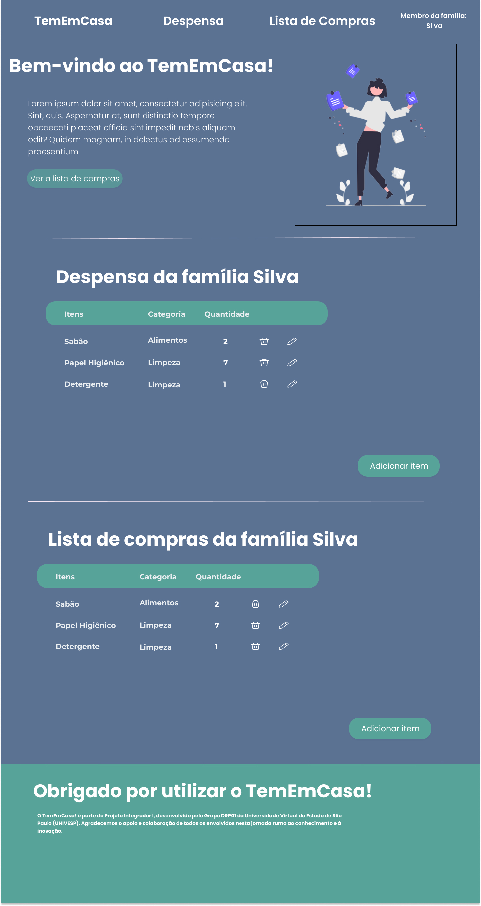

# TemEmCasa!

Bem-vindo ao TemEmCasa! Este é o nosso primeiro Projeto Integrador (PI 1) desenvolvido como parte do nosso currículo universitário. O TemEmCasa! é um sistema web projetado para gerenciar o estoque de alimentos e produtos, com o objetivo de auxiliar indivíduos no planejamento financeiro e organização mensal.

## Visão Geral do Projeto

O projeto TemEmCasa! é baseado em duas metodologias: Aprendizagem Baseada em Problemas e por Projetos (ABPP) e Design Thinking (DT). Nosso objetivo é criar uma aplicação web intuitiva integrada com um banco de dados e práticas de controle de versão.

## Funcionalidades

O TemEmCasa! oferece as seguintes funcionalidades principais:

### Despensa da Família

A Despensa da Família é uma funcionalidade que permite aos usuários gerenciar o estoque de alimentos e produtos disponíveis em suas casas. As principais características incluem:

- **Tabela de Itens**: Exibe uma tabela contendo os itens presentes na despensa, juntamente com sua quantidade e categoria.
- **Editar e Excluir Itens**: Os usuários podem editar informações sobre os itens existentes na despensa ou remover itens que não são mais necessários.
- **Categorias**: Os itens na despensa são categorizados para facilitar a organização e o acesso.

### Lista de Compras da Família

A Lista de Compras da Família permite aos usuários criar e gerenciar listas de compras para suas necessidades domésticas. As principais características incluem:

- **Tabela de Itens**: Exibe uma tabela contendo os itens que os usuários desejam comprar, juntamente com sua quantidade e categoria.
- **Editar e Excluir Itens**: Os usuários podem editar informações sobre os itens na lista de compras ou remover itens que já foram adquiridos.
- **Categorias**: Os itens na lista de compras são organizados por categorias para facilitar o planejamento de compras.

Essas funcionalidades visam proporcionar aos usuários uma maneira conveniente de gerenciar seus estoques domésticos e planejar suas compras de forma eficiente.


## Tecnologias Utilizadas

- Frontend: HTML, CSS, JavaScript
- Backend: 
- Banco de Dados: 
- Controle de Versão: Git, GitHub
- Ferramentas de Design: Figma (para prototipagem)


## Protótipo no Figma



[Veja o Protótipo no Figma](https://www.figma.com/file/CRQCCnP5GnzMxJLswdadb1/Prot%C3%B3tipo-LandingPage-PI?type=design&node-id=1%3A2&mode=design&t=kYdDBsKGUnv6Oht6-1)

## Como Começar

Para executar o TemEmCasa! localmente, siga estas etapas:

1. Clone o repositório do TemEmCasa! para o seu computador:
git clone https://github.com/ibtriz/ProjetoIntegradorI.git

2. Navegue até o diretório do projeto:
```
bash ProjetoIntegradorI
```


3. Abra o arquivo `index.html` em um navegador da web:

   - Clique duas vezes no arquivo `index.html` e ele abrirá em seu navegador padrão.

4. Agora você pode explorar e interagir com o TemEmCasa! localmente em seu próprio ambiente de desenvolvimento.

## Captura de Tela


## Contribuidores

- [Beatriz Francelino Borges Carneiro](https://github.com/ibtriz)
- [Carla Nunes Dias]
- [Flaviele de Souza Cavalcanti]
- [Jalvo Alef Oliveira dos Santos]
- [Marcelo Hideki Yamane]


## Agradecimentos

Gostaríamos de expressar nossa gratidão aos nossos instrutores e colegas pelo apoio e orientação ao longo deste projeto.

## Feedback

Se você tiver algum feedback ou sugestão para melhorias, sinta-se à vontade para abrir uma issue ou entrar em contato conosco diretamente.

Obrigado por se interessar pelo TemEmCasa! 
